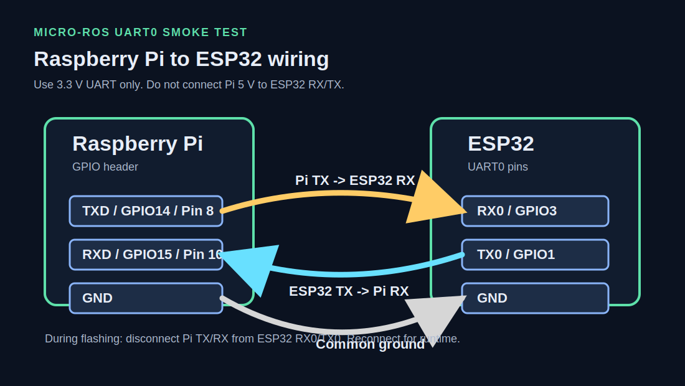

# Wiring

This smoke test uses ESP32 UART0.



## Runtime Wiring

Use crossed UART wiring:

```text
Pi TX / GPIO14 / physical pin 8  -> ESP32 RX0 / GPIO3
Pi RX / GPIO15 / physical pin 10 <- ESP32 TX0 / GPIO1
Pi GND                           -> ESP32 GND
```

Use 3.3 V logic only. Do not connect Pi 5 V to ESP32 RX/TX.

## Flashing Wiring

UART0 is shared with the ESP32 USB upload port. Disconnect Pi TX/RX while flashing:

```text
ESP32 USB -> laptop
Pi TX/RX  -> disconnected from ESP32 RX0/TX0
Pi GND    -> ESP32 GND is okay
```

After flashing:

```text
Close PlatformIO Serial Monitor if open
Reconnect Pi TX/RX
Start the Pi micro-ROS agent
Press ESP32 reset once
```

## Common Mistake

Do not wire TX to TX and RX to RX.

Correct:

```text
Pi TX -> ESP32 RX0
Pi RX <- ESP32 TX0
```

If the agent shows no session activity and `/esp32_ack` is missing, check this first.
